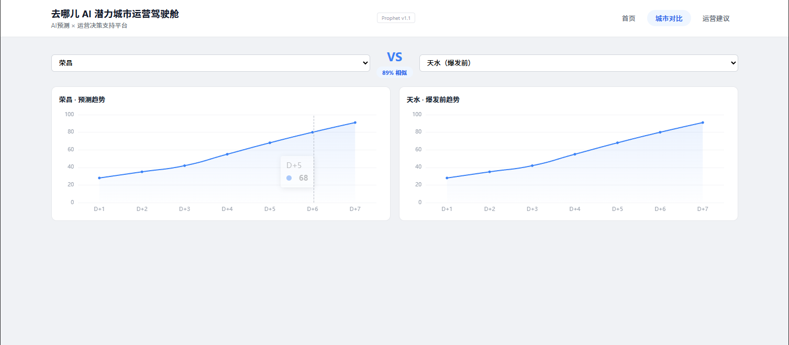
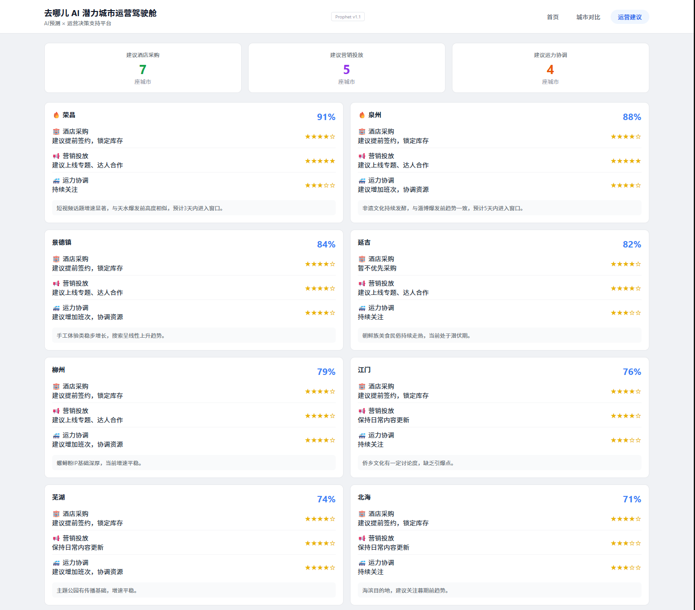
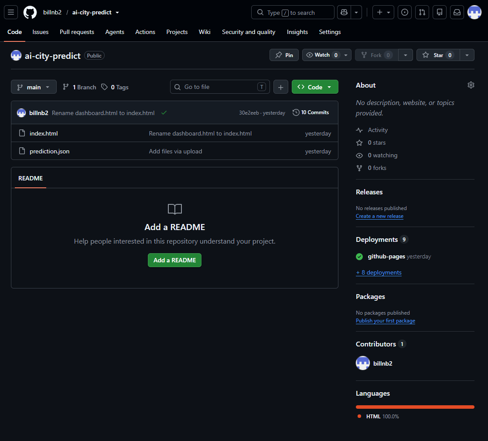
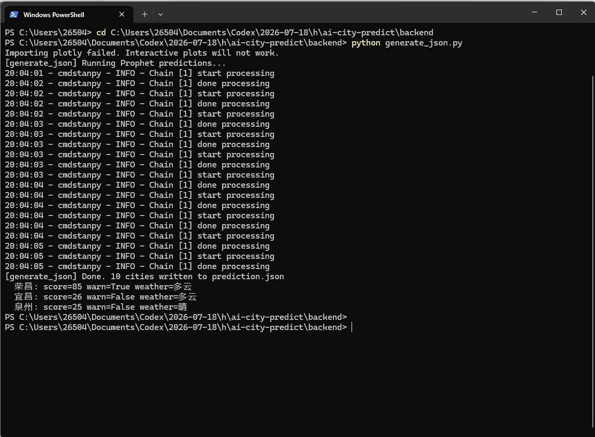

# AI 小城潜力城市运营驾驶舱

> 基于 AI 的潜力旅游城市预测与运营决策支持平台  
> 2026 抖音 AI 先锋未来人才大赛 · 去哪儿旅行赛题 · 香芋队

---

<p align="center">
  
  <br>
  <em>AI 运营驾驶舱 · 潜力城市预测与预警</em>
</p>

---

## 在线体验

| 资源 | 链接 |
|:---|:---|
| 驾驶舱演示 | [https://billnb2.github.io/ai-city-predict/](https://billnb2.github.io/ai-city-predict/) |
| 演示视频 | [https://b23.tv/uwtEJKd](https://b23.tv/uwtEJKd) |
| GitHub 仓库 | [https://github.com/billnb2/ai-city-predict](https://github.com/billnb2/ai-city-predict) |

---

## 项目简介

本系统通过融合多源公开数据（搜索趋势、短视频热度、交通迁徙、天气、节假日等），利用 Prophet 时间序列预测模型，提前识别具有爆火潜力的小众旅游城市，并输出面向去哪儿运营团队的城市预警清单与运营建议。系统已完成从数据采集、特征工程、模型预测到前端展示的完整业务闭环。

## 核心功能

- **潜力城市预测**：基于多源时间序列数据预测城市未来热度趋势并输出预警指数
- **热度趋势分析**：展示目标城市未来 7 天预测曲线及历史搜索趋势
- **AI 判断依据**：多维度信号拆解（搜索、短视频、迁徙、节假日），解释预测理由
- **城市对比分析**：候选城市与历史爆火城市的多维度评分对比
- **运营建议**：基于评分自动生成酒店采购、营销投放、运力协调优先级建议

## 项目预览

<p align="center">
  
  <br>
  <em>驾驶舱首页：Top10 潜力城市列表、热度趋势预测、AI 判断依据、运营建议与时间轴</em>
</p>

<p align="center">
  
  <br>
  <em>城市对比：候选城市与历史爆火城市的多维度评分与趋势曲线对比</em>
</p>

<p align="center">
  
  <br>
  <em>运营建议：按优先级排序的城市运营动作建议，含酒店采购、营销投放、运力协调评分</em>
</p>

<p align="center">
  
  <br>
  <em>GitHub 仓库：完整项目结构与文档</em>
</p>

<p align="center">
  
  <br>
  <em>Prophet 时间序列预测：后端运行成功，生成 10 城市 prediction.json</em>
</p>

---

## 技术栈

| 模块 | 技术 |
|:---|:---|
| 预测模型 | Prophet（Meta 开源时间序列预测框架） |
| 评分模型 | 多维度加权评分（可配置权重） |
| 数据源 | 百度指数、高德迁徙、天气、节假日（公开数据） |
| 前端 | HTML + ECharts + JavaScript |
| 部署 | GitHub Pages |

## 项目结构

```
frontend/        驾驶舱前端（已冻结）
backend/         Prophet 预测 + 评分 + JSON 生成
  predictor.py   时间序列预测模型
  scorer.py      城市运营优先级评分
  generate_json.py  生成 prediction.json
  data/          公开数据 CSV
docs/            项目文档
assets/images/   项目截图
```

## 后续规划

- 接入实时公开数据源，实现自动化数据更新
- 通过 GitHub Actions 实现每日自动预测与部署
- 扩展候选城市池，引入更多特征维度
- 引入 XGBoost/LightGBM 进行效果对比与优化

## 团队

香芋队 · 北部赛区（北京）  
两人团队：算法建模 + 商业分析与文案

版本：v4.2 · 海选最终提交版本

---
