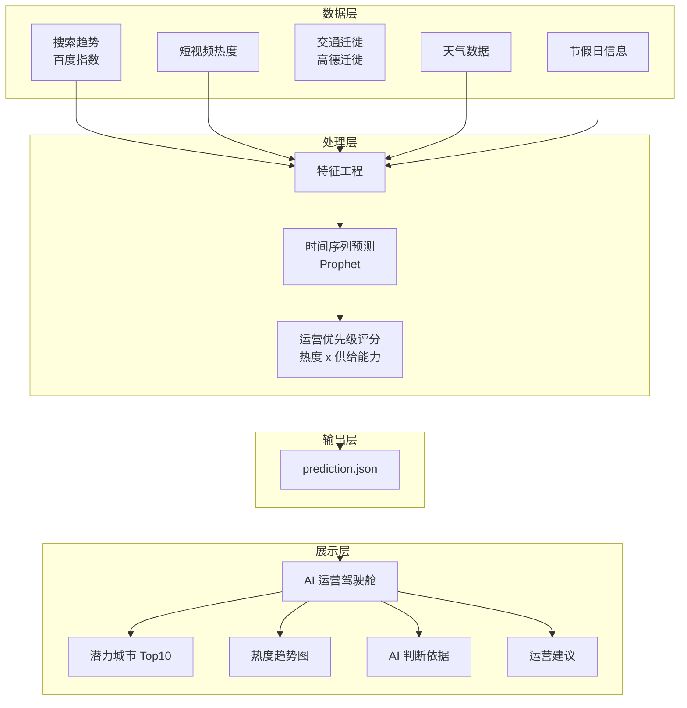

# 系统架构图

将以下 Mermaid 代码粘贴到 [Mermaid Live Editor](https://mermaid.live) 可导出为 PNG 图片。

## 架构说明

本系统定位为"面向去哪儿运营团队的潜力城市预警与决策支持平台"，而非单纯的预测模型。预测仅作为系统的一个模块，最终交付的是可操作的运营预警清单与资源配置建议。系统分为四层：数据层（公开数据采集）、处理层（特征工程与 Prophet 预测）、输出层（prediction.json）和展示层（运营驾驶舱）。