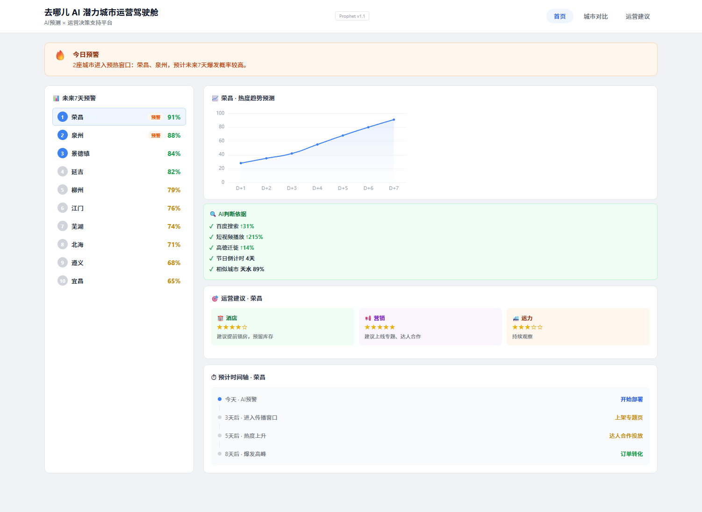

# AI 小城潜力城市运营驾驶舱

> 基于 AI 的潜力旅游城市预测与运营决策支持平台  
> 2026 抖音 AI 先锋未来人才大赛 · 去哪儿旅行赛题 · 香芋队

---

## 在线体验

| 资源 | 链接 |
|:---|:---|
| 驾驶舱演示 | https://billnb2.github.io/ai-city-predict/ |
| 演示视频 | https://b23.tv/uwtEJKd |
| GitHub 仓库 | https://github.com/billnb2/ai-city-predict |

---

<p align="center">
  
  <br>
  <em>AI 运营驾驶舱 · 潜力城市预测与运营决策支持</em>
</p>

---

## 项目价值

帮助去哪儿运营团队在短视频热搜形成前 2-4 周识别具有爆火潜力的小众旅游城市，提前完成资源配置与运营部署，实现从"热点响应"到"热点预判"的能力升级。

## 系统架构

```
公开数据 → 特征工程 → Prophet 预测 → 城市评分 → prediction.json → 运营驾驶舱 → 运营决策
```

## 核心能力

- 多源公开数据融合预测框架
- Prophet 时间序列预测模型
- 城市运营优先级评分（热度 x 供给能力）
- AI 判断依据多维度可视化
- 相似城市传播曲线匹配分析